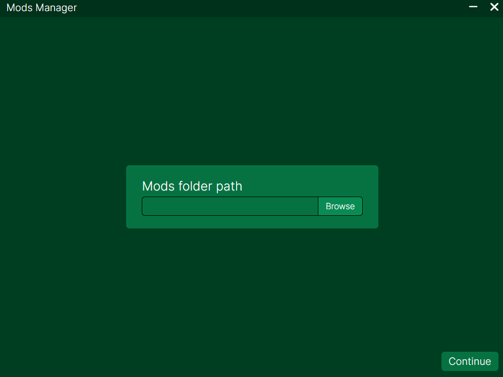
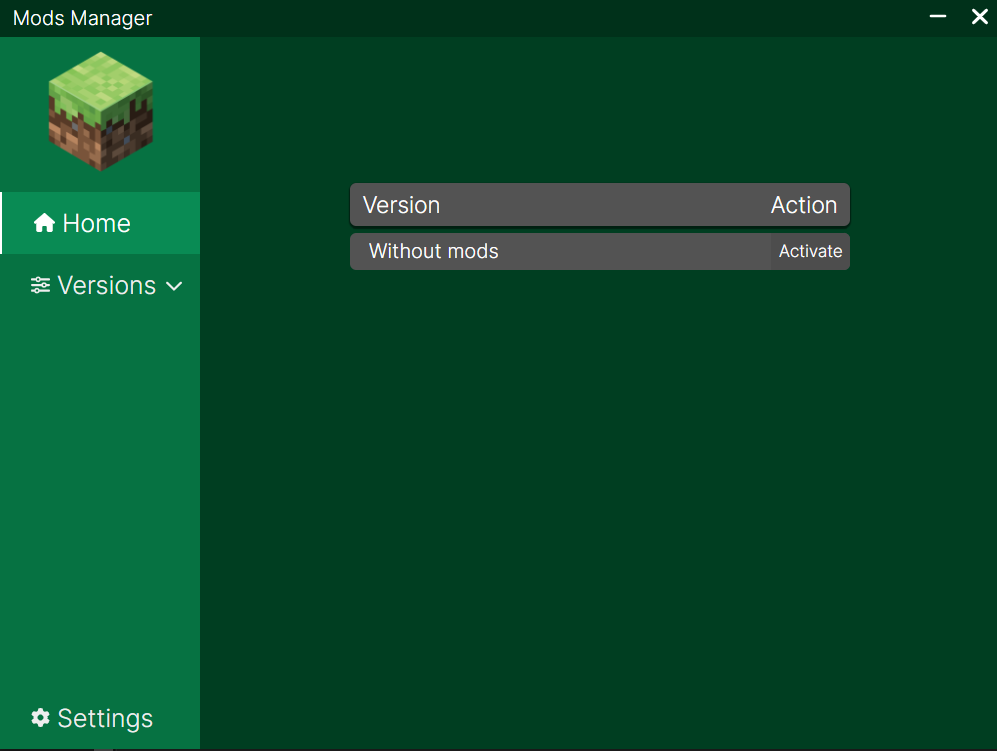
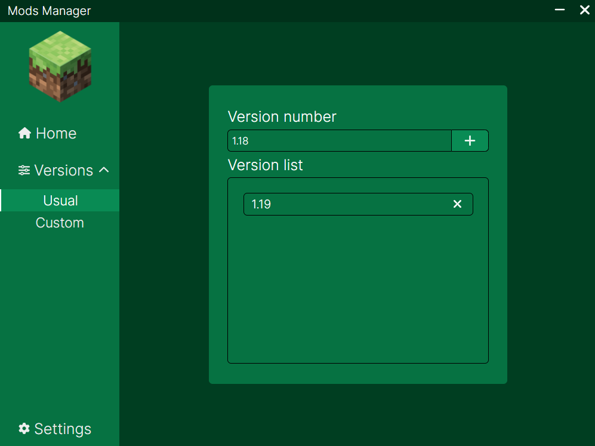
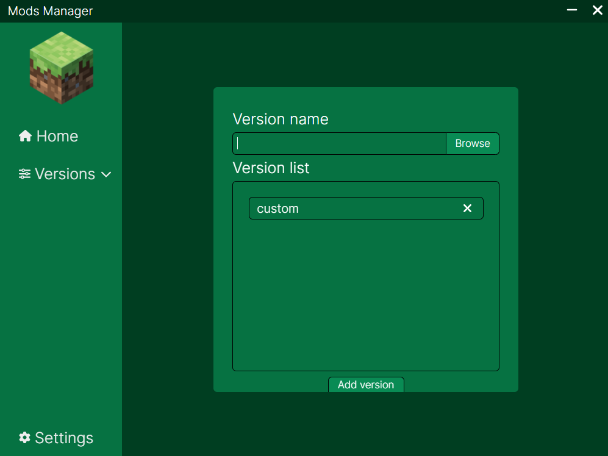
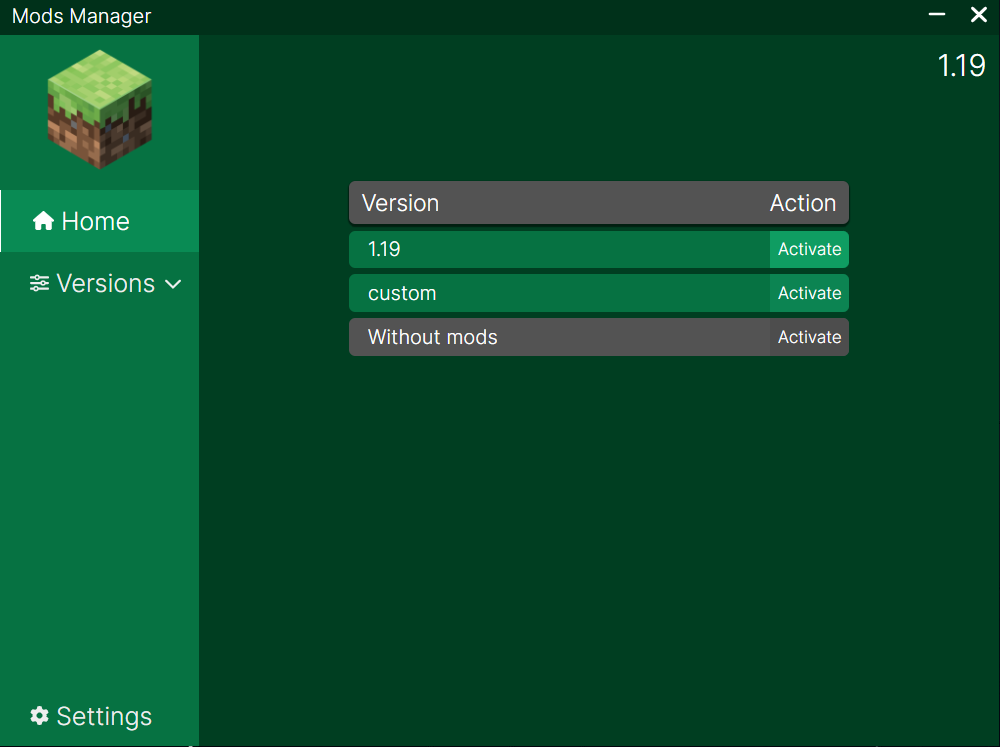

# Mods Manager

Mods Manager is desktop app, which helps you to manage your Minecraft modifications

## Features

- Change active modifications for appropriate game version 
- Create your own custom versions with selected modifications
- Disable all modifications

## Tech

- [ReactJS] - HTML enhanced for web apps
- [Electron] - awesome framework to build cross-platform apps
- [Sass] - powerful CSS pre-processor

## Installation
Go to [releases] and download latest version

## Usage
> ### Important
> - You should rename your modifications before app usage, 
> for example: **mod_name.jar** —> **[version]mod_name.jar**
> in brackets write game version for which this modification appropriate
> - If you want use your modification in both custom and usual version rename
> modification as in example above. If use only in custom version remove
> **[version]** in modification name

After installation the app you should choose modifications path folder

Now you are on the home screen where you can see all versions list, the active version
will be displayed in the top right corner 

On usual versions page you can add versions in format x.xx.x, x.x, x.xx

Custom versions page allow to create versions with selected modifications or to create
your own modpacks

After creating versions you can activate one of them or disable all modifications

## License

MIT

   [ReactJS]: <https://react.dev/>
   [Electron]: <https://www.electronjs.org/>
   [Sass]: <https://sass-lang.com/>
   [releases]: <https://github.com/Vasya564/mods-manager/releases>